# Operationalizing Machine Learning in Azure

## Table of Contents
   * [Overview](#Overview)
   * [Architectural Diagram](#Architectural-Diagram)
   * [Key Steps and Screenshots](#Key-Steps-and-Screenshots)
   * [Screen Recording](#Screen-Recording)
   * [Future Work](#Future-Work)

***

## Overview

The goal of this project is to explore how we would train a machine learning model in Azure and then put it into production. 

In the first part of the project, we will start by training, deploying, and consuming a machine learning model in Azure with AutoML. The Azure Machine Learning Studio interface will be used to train and deploy the best model, which creates a REST API endpoint. Finally, we'll use our Command-Line Interface (CLI) to consume the model with [Swagger](https://swagger.io/).

In the second part, we will create a pipeline that trains a machine learning model and puts it into production using a Jupyter Notebook and the Azure Python SDK.

We use a dataset that contains data regarding direct marketing campaigns (phone calls) of a Portuguese banking institution. The classification goal is to predict if the client will subscribe a term deposit, based on features such as age, job, marital status, and education. The dataset can be found here: [Bank Marketing dataset](https://archive.ics.uci.edu/ml/datasets/Bank+Marketing).

***

## Architectural Diagram
*TODO*: Provide an architectual diagram of the project and give an introduction of each step. An architectural diagram is an image that helps visualize the flow of operations from start to finish. In this case, it has to be related to the completed project, with its various stages that are critical to the overall flow. For example, one stage for managing models could be "using Automated ML to determine the best model". 

Our project will follow the following steps:

***

## Key Steps and Screenshots

   * [Step 1 - Authentication](#Step-1---Authentication)
   * [Step 2 - Automated ML Experiment (AutoML)](#Step-2---Automated-ML-Experiment)
   * [Step 3 - Deploy the Best Model](#Step-3---Deploy-the-Best-Model)
   * [Step 4 - Enable Logging](#Step-4---Enable-Logging)
   * [Step 5 - Swagger Documentation](#Step-5---Swagger-Documentation)
   * [Step 6 - Consume Model Endpoints](#Step-6---Consume-Model-Endpoints)
   * [Step 7 - Create and Publish a Pipeline](#Step-7---Create-and-Publish-a-Pipeline)

We will now go through the key steps of the entire project.

Here's a preview of the dataset we have loaded into AzureML and will be working with:

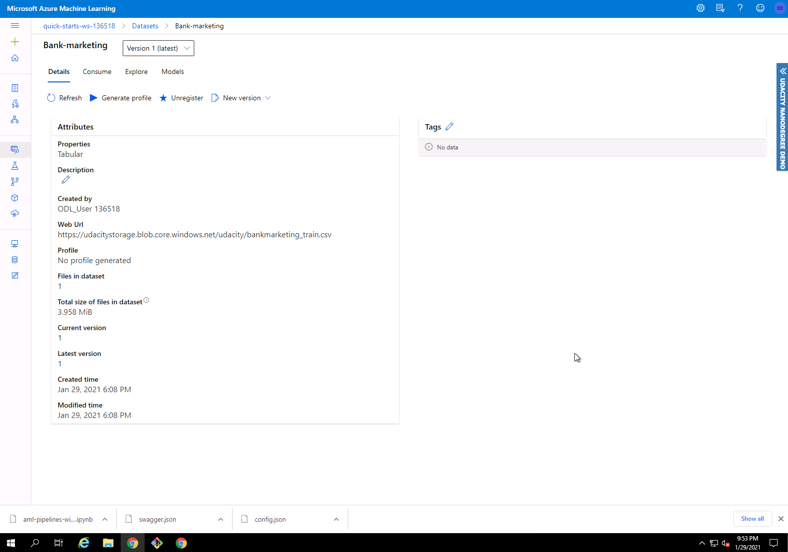

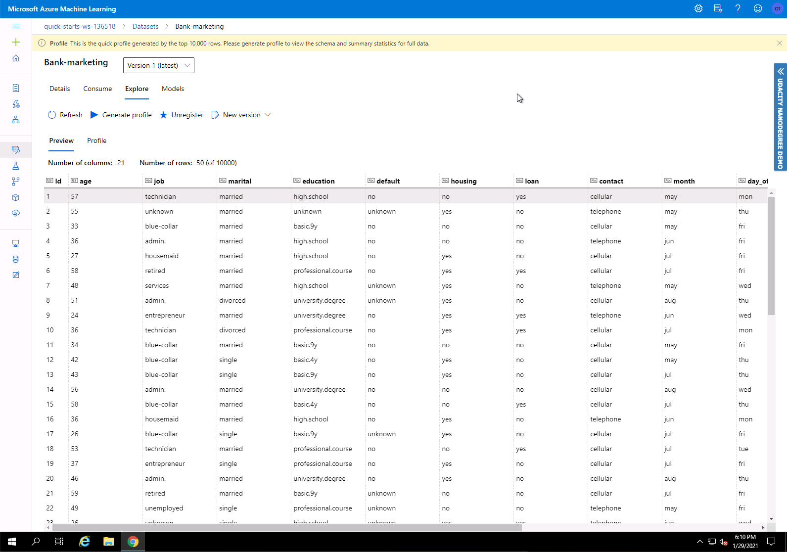

## **Step 1 - Authentication** 

**Key point:** Authentication is important for giving users different levels of privileges. In our case, we are using the Udacity workspace, so we cannot create a Service Principal. Therefore, can skip this step.

### **Step 2 - Automated ML Experiment** 

**Key point:** AutoML allows you to automatically run a series of different machine learning algorithms and parameters for you. In this project, we provide AutoML some custom configurations, run it, then choose the best model.

After AutoML has finished all of its runs, we can start working with the best model out of all the models. In this case, there were 85 runs coompleted and the best model was a Voting Ensemble with an accuracy of 91.866% and AUC macro of 94.615%.

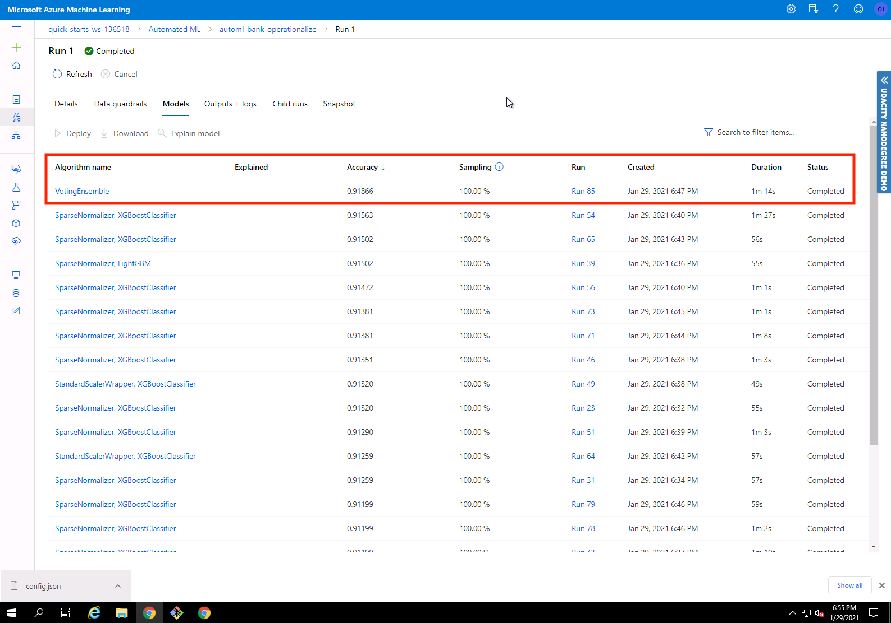

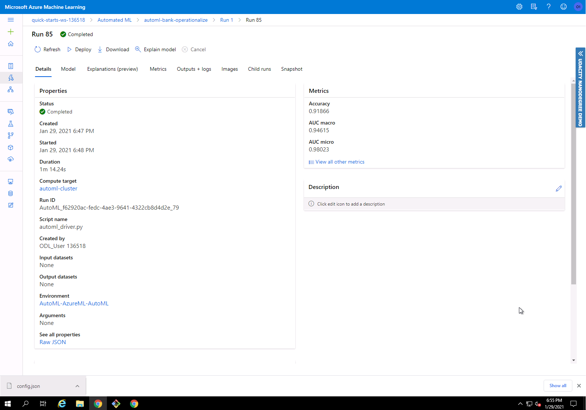

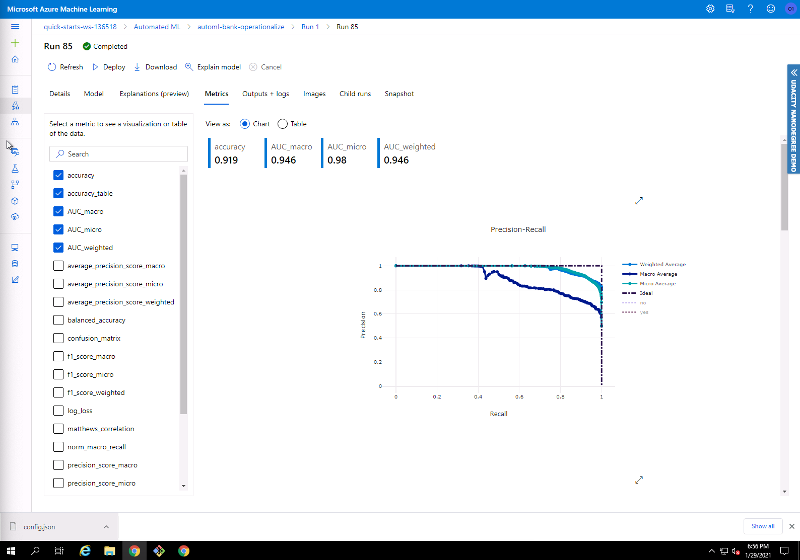

One of the benefits of AutoML (and AzureML in general) is that we can quickly get a better understand of our data as well as what the model is doing to predict the target variable(s). The Explanations tab for a given model can save a data scientist a lot of time upfront because it helps them quickly identify issues with the data that may hinder performance or lead to dangerous outcomes (performing poorly on certain groups of people and performing exceptionally with others). 

On a personal note, I think the Explanations tab can be quite useful to nudge data scientist to consider the harmful effects of their models. It's quite easy to overlook this part of the process since you may have outside pressure to get things done or all of the courses you took never really prepared you for looking at harmful effects of models and correcting them. Therefore, Explanations may ease people into thinking more about the issues with their models. If you focus too much on total model performance, you won't end up looking at the data in your dataset that perform much more poorly than the average. Yes, paying attention to these issues is likely to increase model performance, but it's essential to take into consideration in a production environment because some subsets of your datasets may carry more importance than others. It may be more important to have 90% accuracy for all subsets of your data than it is to have 95% for most and 80% for others. Explanations makes that process quick and easy.

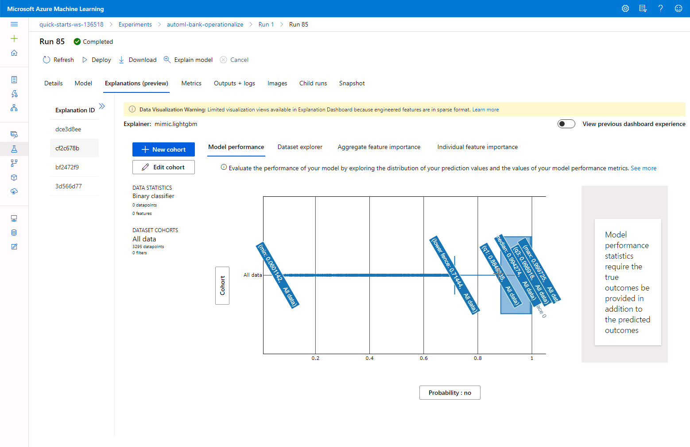

We can even see which raw and preprocessed features are the most important for predict our target variable(s). For this dataset, it seems that the call duration and the number of employees in a specific bank.

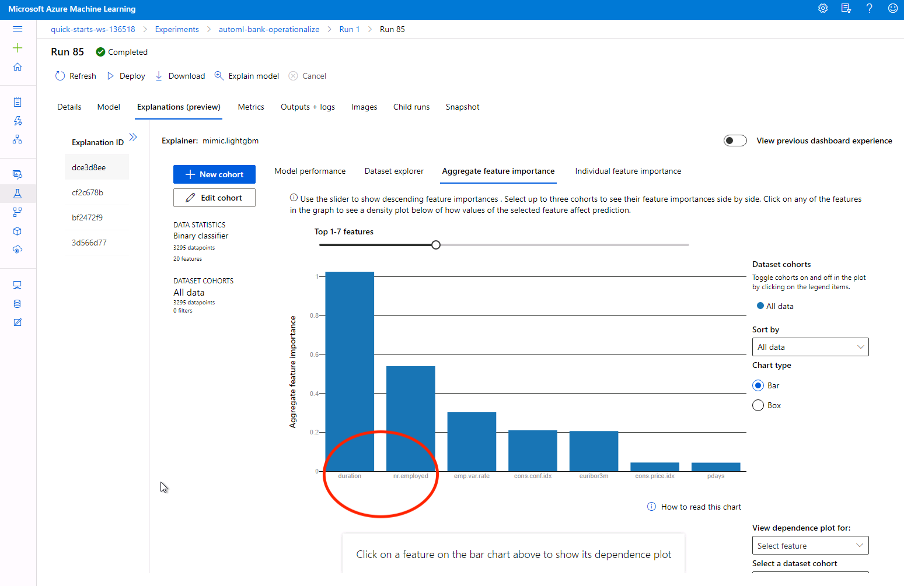

And for the preprocessed data:

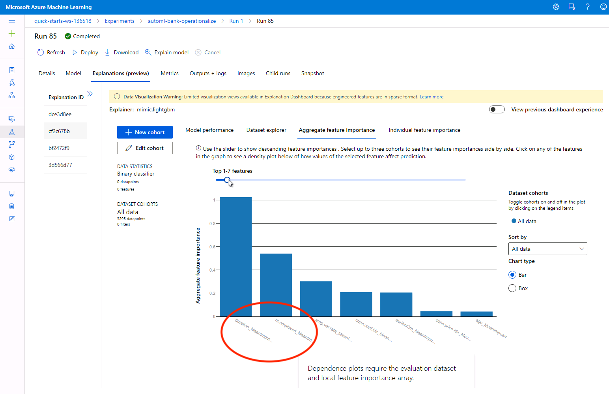

### **Step 3 - Deploy the Best Model** 

**Key point:** Deploying means that we are creating an endpoint (in this case, REST API) that allows us to interact with the HTTP API service. For this project, we will allow the HTTP API service to interact with the best AutoML model by sending POST requests to the endpoint.

By clicking the Deploy tab in our best model's page (Run 85), we deployed our model. As we can see in the image below, the deployment state is healthy, meaning that our model has been deployed and the REST endpoint is active. We will be interacting with our deployed model in step 6.

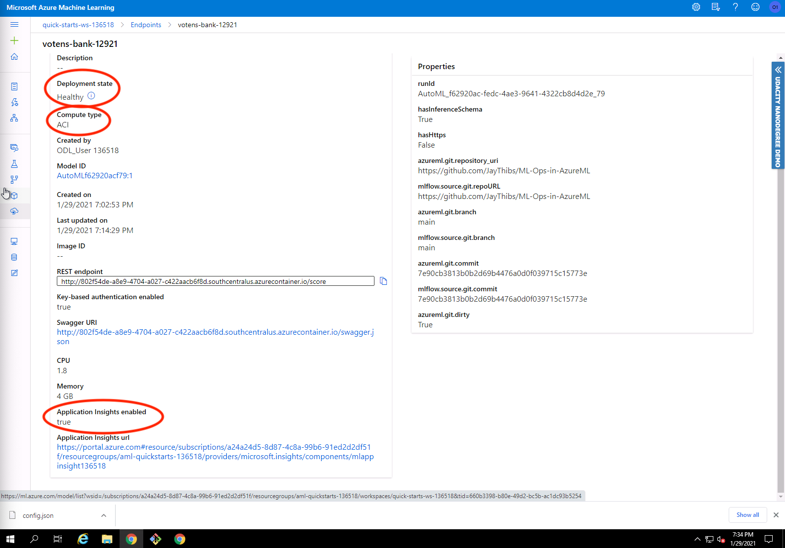

As we can see, Application Insights is enabled. This is something we do in the next step. It is possible to deploy the model with Application Insights turned on, but we did it via our local command-line interface for this project.

Also, we can see the Swagger URI here. If you look at the end of the URI, you can see that it's actually linking to the swagger.json file. We will be using this file later to create the Swagger Documentation (step 5). Download it and put it in the swagger folder of our local project directory.

### **Step 4 - Enable Logging** 

**Key point:** In Azure, we can enable logging by enabling Application Insights. Application Insights is a useful tool to detect anomalies and visualize performance of our deployed model. We can enable Application Insights when we are deploying our model, but we will enable it via our CLI for this project.

Before we can enable Application Insights, we need to download the config.json file from the Azure Machine Learning Studio and put it in our base (local) directory where we will run the code.

To enable Application Insights in our CLI, we need to create a logs.py file. In the file, we include `Workspace.from_config` to get the configuration information for our workspace in Azure. We also include the name of our deployed model.

To enable Application Insights, we need to make sure to include the following line of code: `service.update(enable_app_insights=True)`, where `service` is the existing web service and includes the information of our workspace and deployed model.

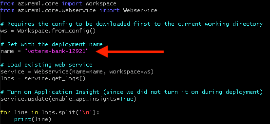

Now that we've created our logs.py file, we can run it to enable Application Insights. We run it with: `python logs.py`.

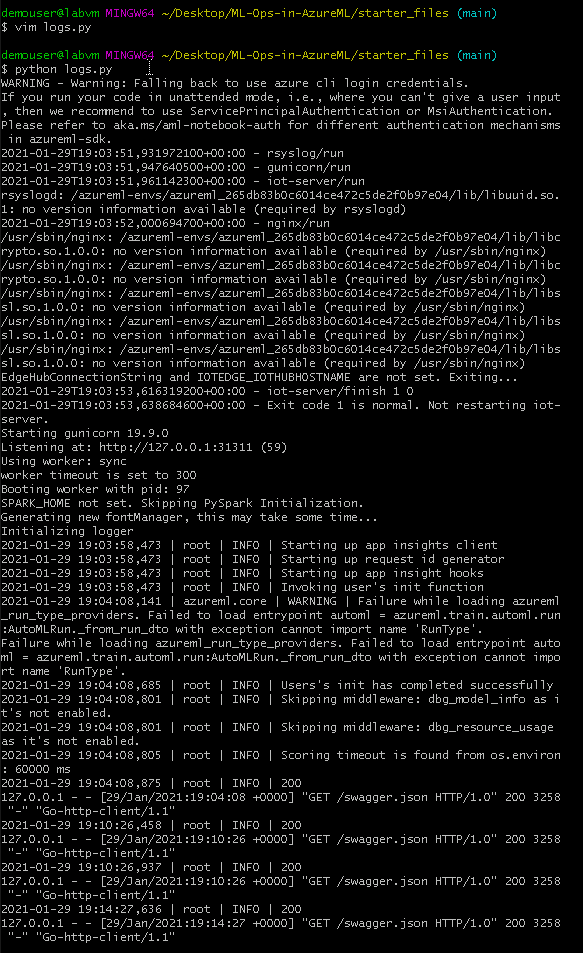

### **Step 5 - Swagger Documentation** 

**Key point:** Swagger is a framework for describing an API using a common language that everyone can understand. Azure provides a Swagger JSON file for deployed models that can look up in your IDE or in the Swagger UI. Any mistakes are flagged, and alternatives are suggested. At the heart of Swagger is its specification. The Swagger specification is the rulebook that standardizes API practices (how to define parameters, paths, responses, models, etc). And every other part of Swagger is just a way of appropriating or creating API documentation that works with these rules. Reference: [What is Swagger and Why Does it Matter?](https://blog.readme.com/what-is-swagger-and-why-it-matters/)

We will now be using the Swagger JSON file we downloaded earlier (in step 3) from the Endpoints section in Azure. Make sure it is in the swagger folder.

Now, we run `swagger.sh` and `serve.py`. Afterwards, we go in our browser and navigate to http://localhost/. We will see the following:

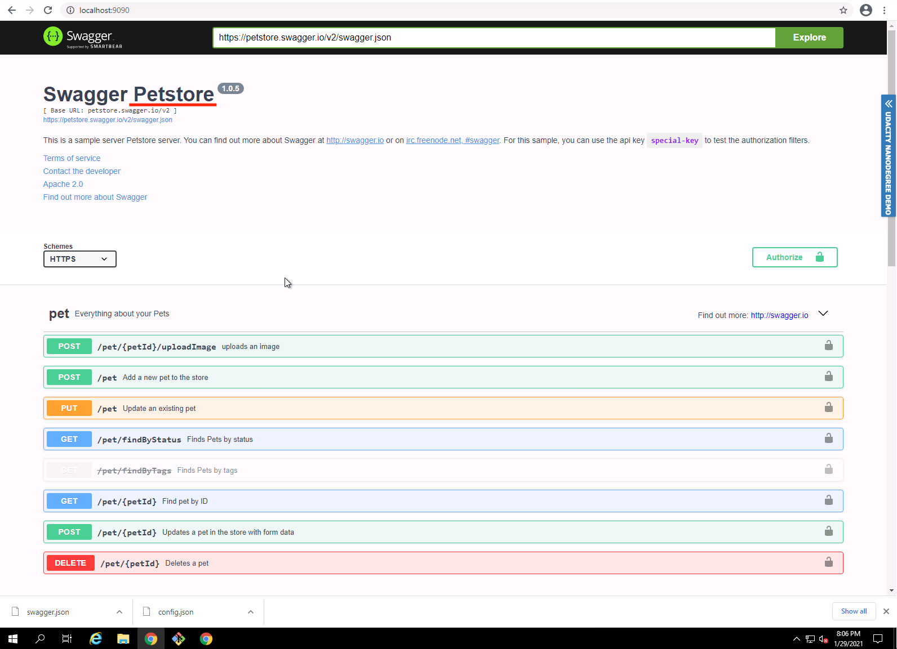

This is an example documentation from Swagger. To see the documentation for our model endpoint, we type in the text box on top of the page: `http://localhost:8000/swagger.json`. We click Explore and see the following page:

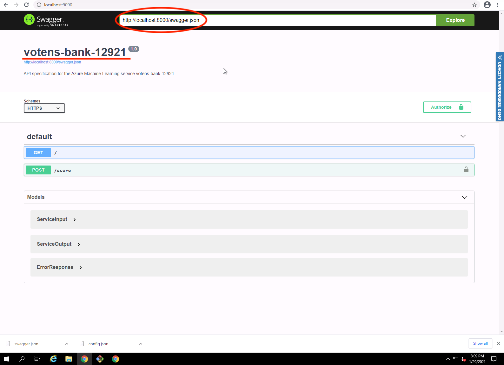

As we can see, this is the Swagger documentation for the model we deployed.

If we open up the "Models" portion of the page, we see what the input and output data looks like:

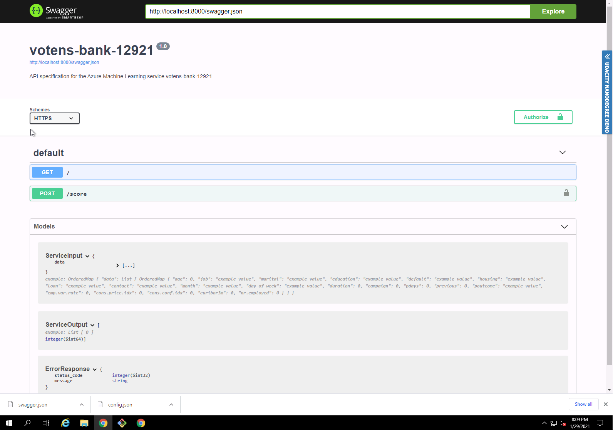

We can also open the `GET` and `POST` sections to see what we should expect from those methods:

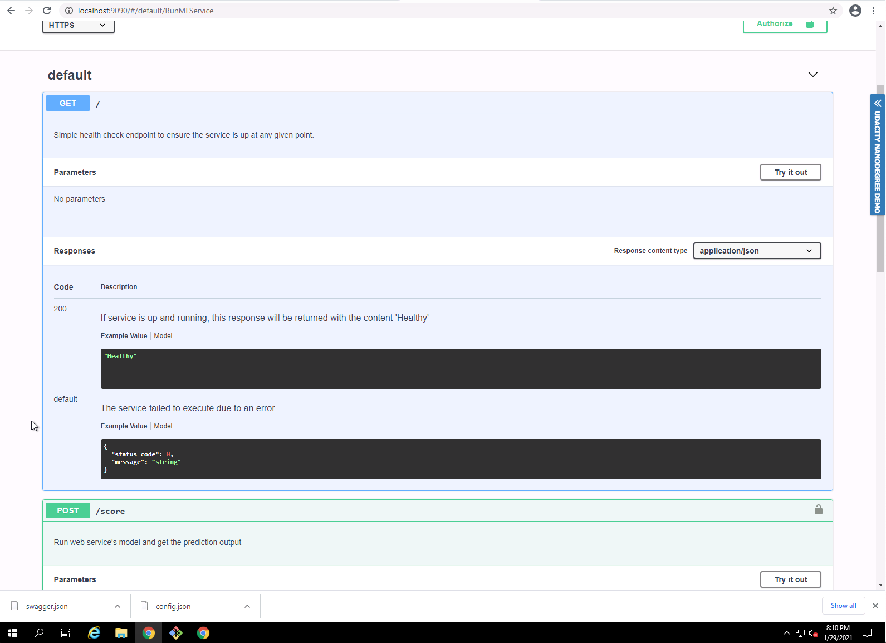

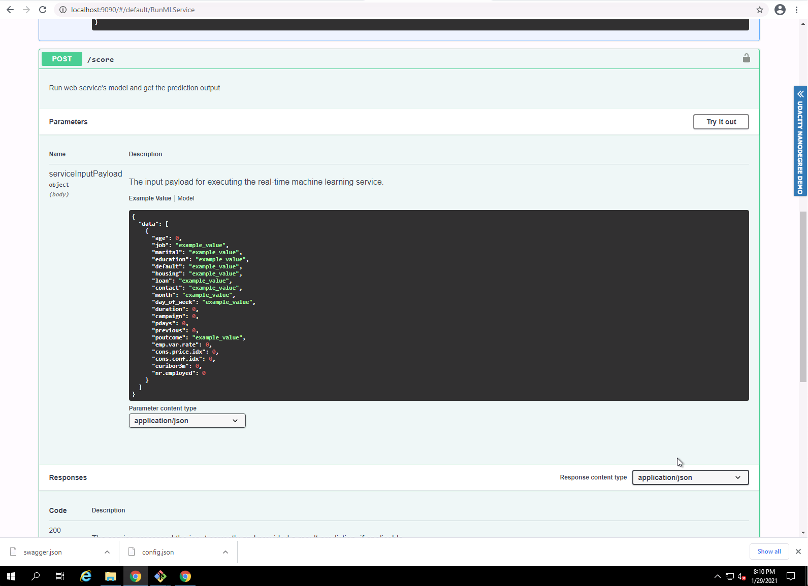

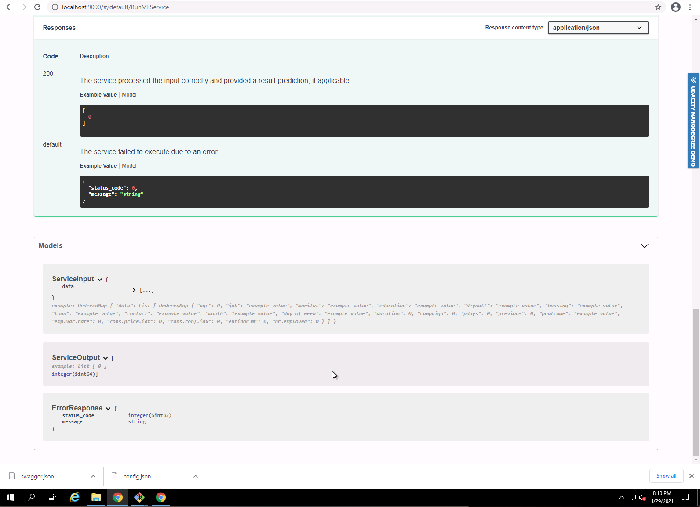

### **Step 6 - Consume Model Endpoints** 

**Key point:** Here we perform model inference in our local CLI by using the REST endpoint URL and Primary Key (for authentication) of our deployed model.

We will now be running the `endpoint.py` file. We make sure to include the proper `scoring_uri` and `key` to match the REST endpoint and primary key respectively. We can find them in the Consume tab of our model endpoint (in the Endpoint section). 

The `endpoint.py` will allow use to feed data to the model, do inference, and receive a prediction. Looking inside the script, we see that we create a data file in json format and feed it to the model to receive the prediction.

Here's what `endpoint.py` looks like:

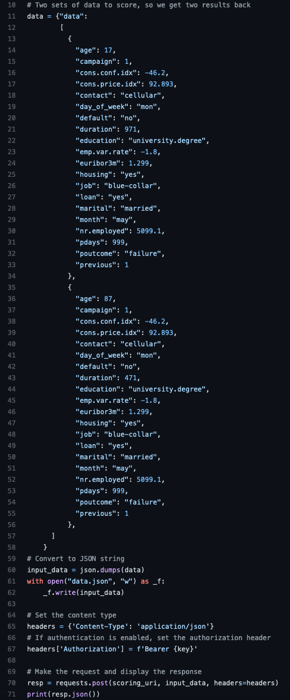

We can see that there are two predictions that will be made.

Now, if we run `python endpoint.py` in our command line, we get the following prediction based on the data we provided to the model via the REST endpoint:

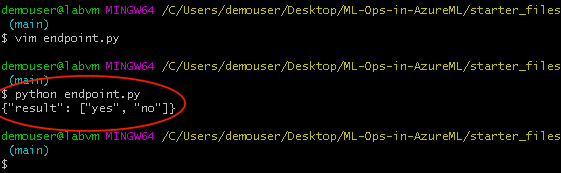

As we can see, the model predicted that client #1 will sign up with the bank while client #2 won't.

Here's the `data.json` file that was created when running `endpoint.py`:

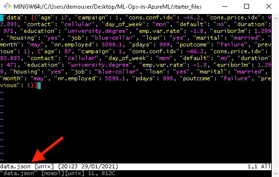

**Benchmarking the Endpoint**

Next, we will be benchmarking the HTTP API to test the response time for our deployed model. *A benchmark is used to create a baseline or an acceptable performance measure.*

*"Apache Benchmark is an easy and popular tool for benchmarking HTTP services."*

(Ref: https://www.udacity.com/course/machine-learning-engineer-for-microsoft-azure-nanodegree--nd00333)

In other words, we will use Apache Benchmark to load-test our model. This is an important step to do when putting our model in production because we want to make sure that it doesn't take too long to receive prediction results and users have a great experience with your product or service. Note: Azure will timeout if the response time takes longer than sixty seconds.

So, `benchmark.sh` contains the Apache Benchmark command we need to do the benchmark. The command will send 10 requests to the endpoint. To run the file, we enter: `bash benchmark.sh` and we get the following output:

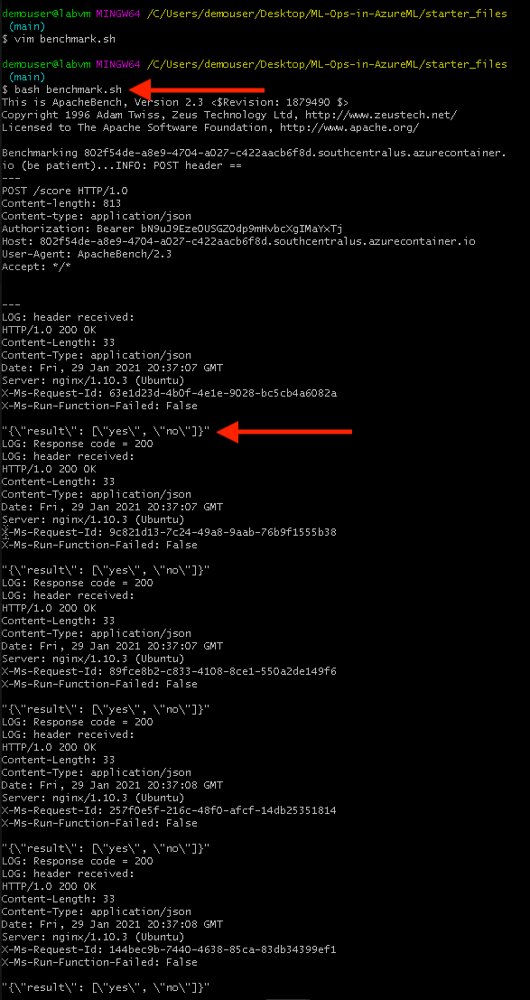

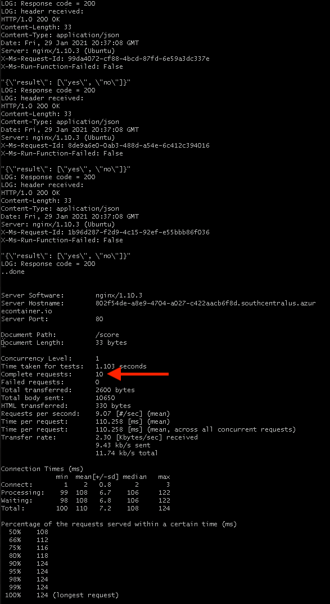

We can see that the mean time taken for each request is 110.258 ms, which is great and likely fast enough in a production environment.

### **Step 7 - Create and Publish a Pipeline** 

**Key point:** An important part of MLOps is to automate workflows via Pipelines. For this project, we will be using a Pipeline to automate the entire process (minus step 4 and 5). Creating a pipeline via the Azure Python SDK is useful allows us to automate the process and share our steps with colleagues.

We start by opening our python [notebook](https://github.com/JayThibs/Operationalizing-ML-with-Azure/blob/main/aml-pipelines-with-automated-machine-learning-step.ipynb) in Azure and running all of the cells. As we can see, we've submitted a pipeline run:

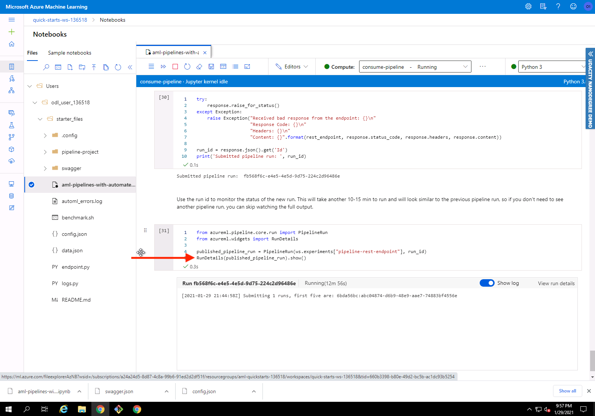

If we go to the Pipelines page (click on the Pipelines icon in the sidebar), we can see that our pipeline run is active:

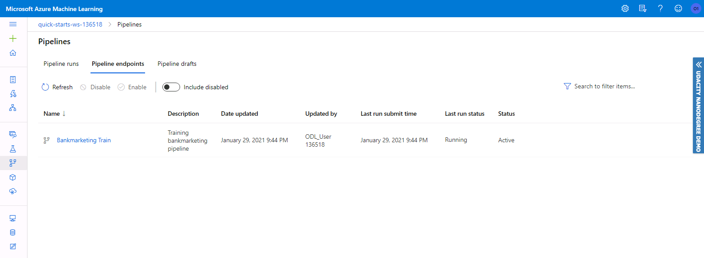

Clicking on the Bankmarketing Train pipeline run:

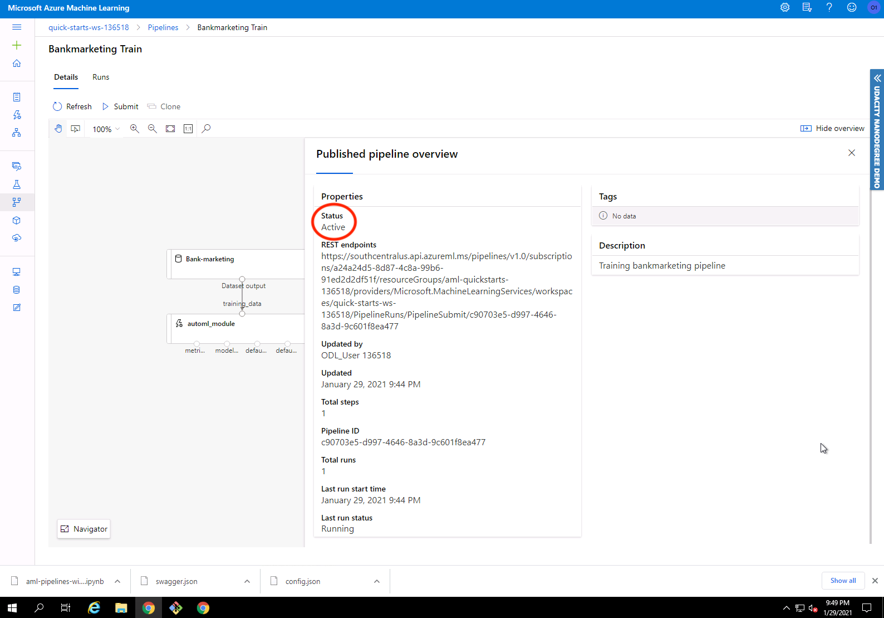

Once the pipeline has finished running, we have a pipeline REST endpoint that we can find in Experiments. We see that the status of the pipeline run is now complete:

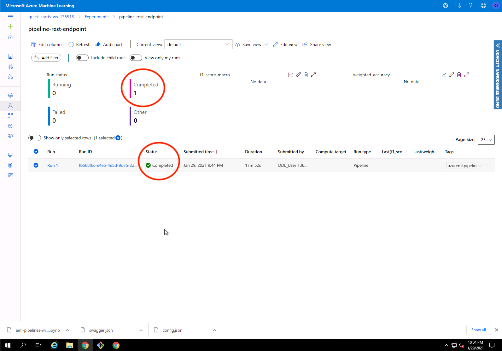

And there we are! We've now trained an AutoML model, and deployed it to create REST endpoint we can now interact with.

***

## Screen Recording

Here's a link to a video explaining the different parts of the project: [Operationalizing ML Screencast - Jacques T](https://www.youtube.com/watch?v=mH5c6UD4-Vk&feature=youtu.be)

***

## Future Work

* Fix the imbalance in the dataset.
* We could interact with the model deployed via pipeline in step 7 of Key Steps. We could set a threshold for minimum acceptable model accuracy, use data which does not perform well with our current model, and kickstart a retraining process to take into account the more recent data (and reduce model drift).
* We could use a custom model in addition to the best AutoML model and have our pipeline choose the best out of the two.

***

[Back to Top](#Operationalizing-Machine-Learning-in-Azure)
